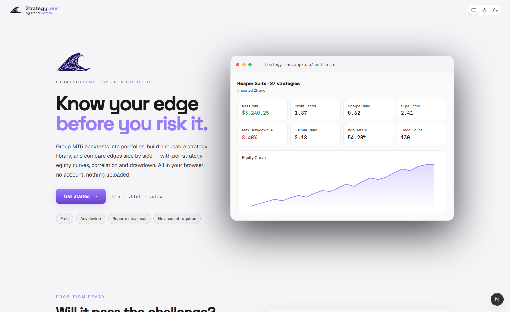
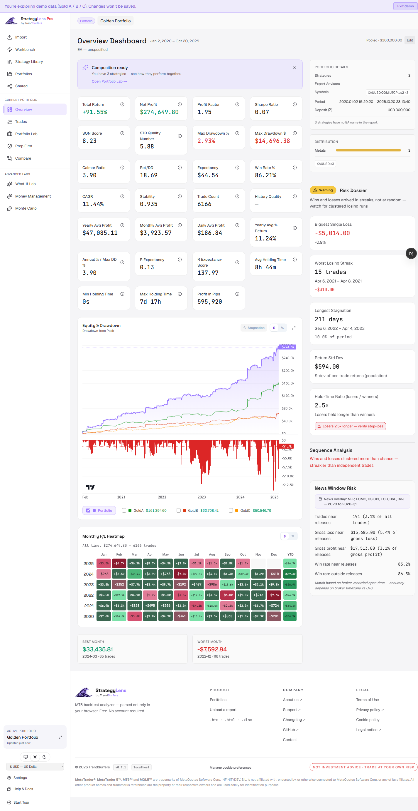
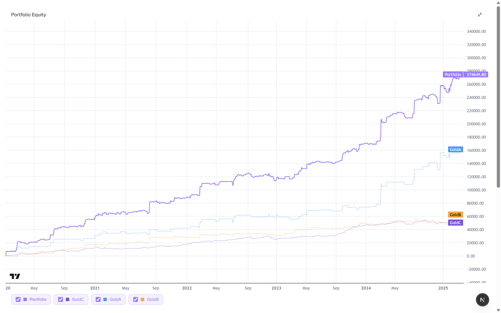

# StrategyLens

> Free, private, browser-based analysis for your MetaTrader 5 backtests and trading history — your data never leaves your device.

**▶ Open it now: [strategy-lens.app](https://strategy-lens.app)** &nbsp;·&nbsp; a [TrendSurfers](https://trendsurfers.io) product

---

## What is StrategyLens?

StrategyLens turns raw MetaTrader 5 Strategy Tester reports and account history into clear, institutional-grade analytics — right in your browser. Drop in a report and instantly see the numbers that actually matter: risk-adjusted return, drawdown, expectancy, and dozens more, computed to the precision professional analysts expect.

**100% local processing.** Every calculation runs on your own device via WebAssembly. Nothing is uploaded, nothing is stored on a server — close the tab and it's gone. Your strategies stay yours.

**Free to use.** No account required to analyze. Open the app, drag in a report, done.

---

## Why traders use it

- 🔒 **Private by design** — local processing; your reports never leave your browser.
- ⚡ **Instant** — drag a `.htm` or `.xlsx` report in and get a full dashboard in seconds.
- 📊 **Institutional-grade metrics** — Sharpe, SQN, Profit Factor, Calmar, Stability, Expectancy, R-Expectancy, drawdown in both $ and %, average holding time, and many more.
- 🧩 **Build portfolios** — combine strategies and see merged equity, true portfolio drawdown, and correlation.
- 🏦 **Prop-firm ready** — check a strategy against 60+ prop-firm rule sets (FTMO, The5ers, FundedNext, and more) before you risk an evaluation.
- 🎲 **Stress-test** — Monte Carlo, What-If, and Money-Management labs.
- 📱 **Installable** — works offline as a PWA on desktop and mobile.

---

## A closer look

### Portfolio overview
See every strategy in one dashboard — combined equity curve, drawdown, and the full metric grid.

### Compare strategies side by side
Overlay every strategy's equity curve against the combined portfolio — see which edges carry the book and how they move together.

---

## Supported inputs

- MetaTrader 5 Strategy Tester reports (`.htm` / `.html`)
- MetaTrader 5 Excel exports (`.xlsx`)
- Account history (`.csv`)
- TrendSurfers portable strategy archives (`.tspa`)

---

## Part of the TrendSurfers suite

StrategyLens is one piece of the TrendSurfers toolkit for systematic traders:

- **[Portfolio Manager](https://github.com/trendsurfers-software/portfolio-manager)** — desktop backtesting, portfolio construction, and parallel optimization.
- **[MT Manager](https://github.com/trendsurfers-software/mt-manager)** — deploy and govern strategies across your MetaTrader 5 terminals.

Explore the full toolkit at **[trendsurfers.io](https://trendsurfers.io)**.

---

## Releases

Version history and release notes live under **[Releases](../../releases)**.

---

## Contact

| | |
|---|---|
| Web app | [strategy-lens.app](https://strategy-lens.app) |
| Website | [trendsurfers.io](https://trendsurfers.io) |
| General / Support | [hello@trendsurfers.io](mailto:hello@trendsurfers.io) |
| Legal | [legal@trendsurfers.io](mailto:legal@trendsurfers.io) |

---

## License & Legal

By using StrategyLens you agree to the **[End User License Agreement](https://trendsurfers.io/eula/)**. If you do not accept the EULA, do not use the software.

| Legal document | Link |
|---|---|
| End User License Agreement (EULA) | [trendsurfers.io/eula/](https://trendsurfers.io/eula/) |
| Privacy Policy | [trendsurfers.io/privacy/](https://trendsurfers.io/privacy/) |
| Legal Notice (Aviso Legal) | [trendsurfers.io/legal/](https://trendsurfers.io/legal/) |
| Trademark Notices | [trendsurfers.io/legal/#trademarks](https://trendsurfers.io/legal/#trademarks) |

### Trademark Disclaimers

MetaTrader 5 and MetaTrader are trademarks of MetaQuotes Ltd. StrategyLens is an independent tool and is not affiliated with, endorsed by, or sponsored by MetaQuotes Ltd.

FTMO, The5ers, FundedNext and all other prop-firm names referenced are trademarks of their respective owners. StrategyLens is not affiliated with, endorsed by, or sponsored by any prop firm; prop-firm rule sets are provided for informational checking only and may not reflect each firm's latest official rules.

All other trademarks are the property of their respective owners.

### Trading Risk Disclaimer

Trading foreign exchange and derivatives carries a high level of risk and may not be suitable for all investors. Past performance is not indicative of future results. StrategyLens is an analysis tool and does not provide financial advice or trading signals.
